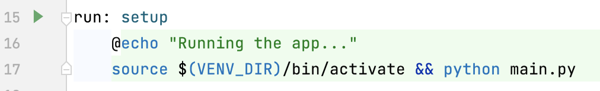
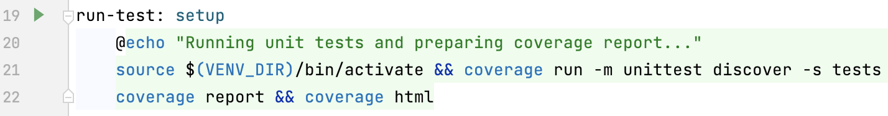
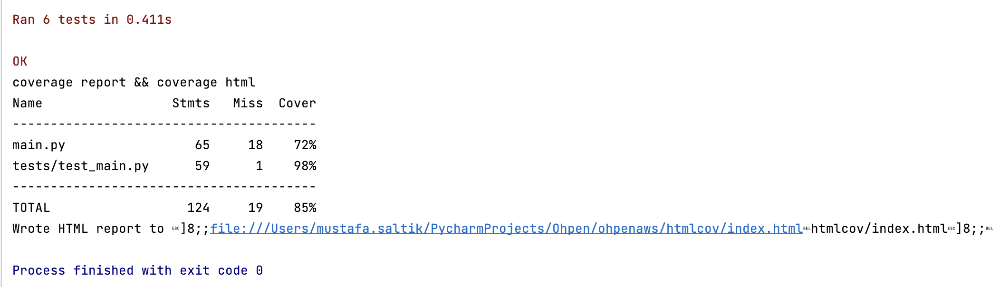
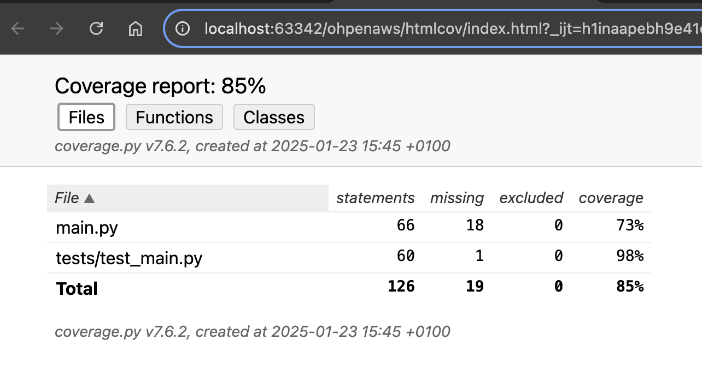
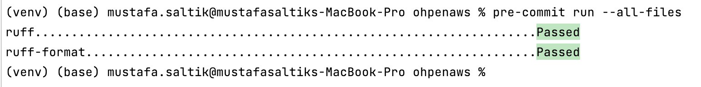

## Table of Contents

- [Project Overview](#project-overview)
- [Project Structure](#project-structure)
- [Prerequisites](#prerequisites)
- [Installation](#installation)
- [Running the project](#running-the-project)
- [Testing and Test Coverage](#testing-and-test-coverage)
- [Code Styling](#code-styling)
- [Next Steps](#next-steps)


## Project Overview
This project implements a data processing and validation using AWS S3. 
The pipeline extracts data from CSV files, performs validations, and loads the processed data in parquet formats for better performance on analytics.

## Project Structure

The project is organized into the following structure:

```
project/
├── .github/
│   ├── workflows/
│       ├── cicd.yaml          # CI/CD steps including automated tests, pre-commit hooks, and deployment 
├── htmlcov/
│   ├── ...
│   ├── index.html             # Test coverage html report to visualize test results on browser
│   ├── ...
├── terraform/
│   ├── main.tf                # IaC
├── tests/
│   ├── test_main.py           # Unit tests for data reading,processing and uploading modules
├── .gitignore                 # Files and folders which shouldn't be committed to remote
├── .pre-commit-config.yaml    # pre-commit hooks
├── main.py                    # Main script to run the ETL pipeline
├── Makefile                   # Makefile for automating tasks for local environment setup and runs
├── README.md                  # this file
├── requirements.in            # Libraries required for the project
├── requirements.txt           # Python dependencies with specific versions required for the project. This file is autogenerated using pip-compile.
```

## Prerequisites

Ensure you have the following installed:
- Python 3.10 or later

## Installation

**Clone the Repository:**
   ```bash
   git clone git@github.com:mustafasaltik/ohpenaws.git
   cd ohpenaws/
   ```

## Running the Project
- From terminal : ```make run```
- Or using MakeFile; just click to the run button next to the **run**



It will;
1. Create virtual environment
2. Upgrade pip and install all the requirements mentioned in the requirements.txt
3. Activate virtual environment
4. Run the main.py

## Testing and Test Coverage
- From terminal : ```make run-test```
- Or using MakeFile; just click to the run button next to the **run-test**



Once you run the tests, you can see the report; 

1. From the terminal like below:



2. From the browser with opening ```htmlcov/index.html``` like below:



And it'll be available to investigate which parts have been covered by unit tests.

## Code Styling
- We are utilizing Ruff, and it's configured as pre-commit hooks(```.pre-commit-config.yaml```).
- ```pre-commit run --all-files```



## Next Steps

- Set Up Monitoring and Alerting
- Separate staging and transformation layer 
- Data modelling (fact and dimension)
- Automated data quality checks and integrate with alert system if there is any DQ problem
- Exception handling can be improved with using more detailed error messages using custom exceptions
- Incremental logic should be applied for both extraction and transformation layer (to not process entire data on every run)